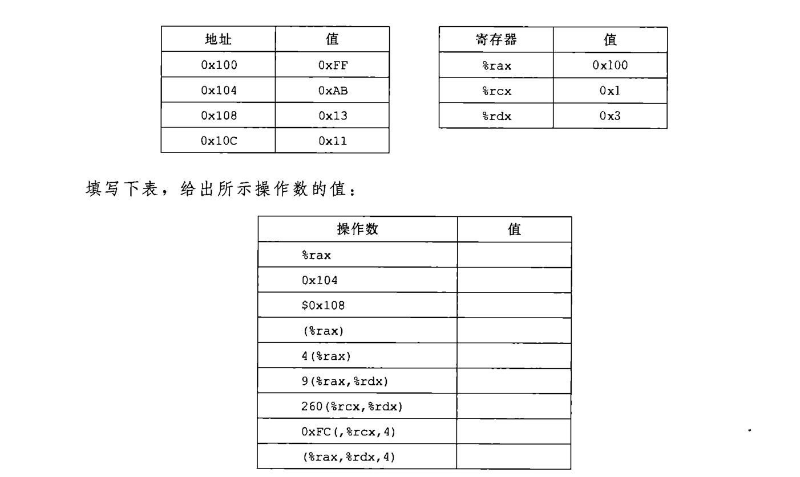

### 操作数
汇编指令后面会跟随操作数 *operand* 可分为三种:
- 常数值 '$ '后面跟一个用标准C表示法表示的整数,比如, **$-577** **$0x1F**
- 寄存器值 %rax 等寄存器,里面是内存地址
- 内存地址 Imm(r1,r2,s) 访问该内存地址内部的数据[^1]
  
  - 计算方法为 Imm[^2]+r1+r2*s , 有s必有r2 , Imm和r1至少有一个  
[^2]:immediate 立即  
[^1]:只能使用64寄存器名称  

