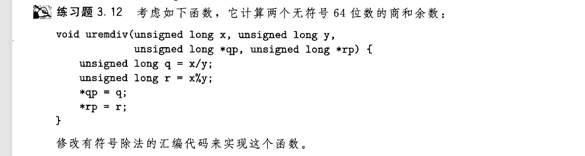
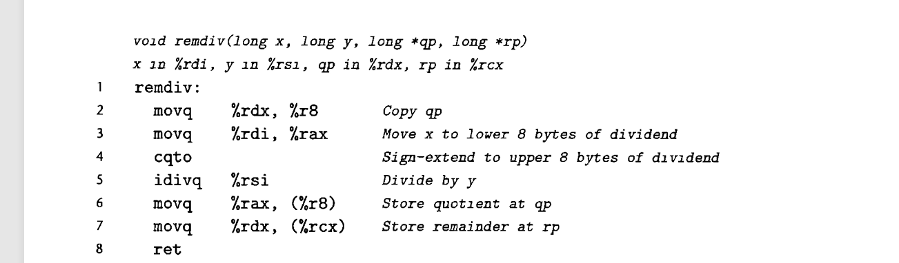

## 高位乘除法
当64位数乘以64位数时.结果可能是128位的,因而使用**两个寄存器** `%rdx %rax` 储存结果  
含有如下乘除相关的汇编指令：
- imul src,dest `正常执行`
- imul dest     `将dest与特定寄存器%rax中的值相乘,返回到%rdx(高位)和%rax(低位)中`
- mul dest      `无符号乘法`
- idiv src,dest
- idiv dest[^1]
- div dest      `除法与乘法同理`  
[^1]:高位除法操作可以同时产生商和余数 , 商存放在%rax中 , 余数存放在%rdx中  

注意:**进行除法前需要对%rdx进行清零** , 有符号除法使用`cqto`指令 , 无符号直接`movl $0,%edx` , 或者使用**异或**  
看题:

- 有符号除法的汇编代码参考:

知识点:
- 该题考查对%rdx的清零操作 , 将`cqto`替换为`movl $0,%edx`即可

[返回README](./README.md)