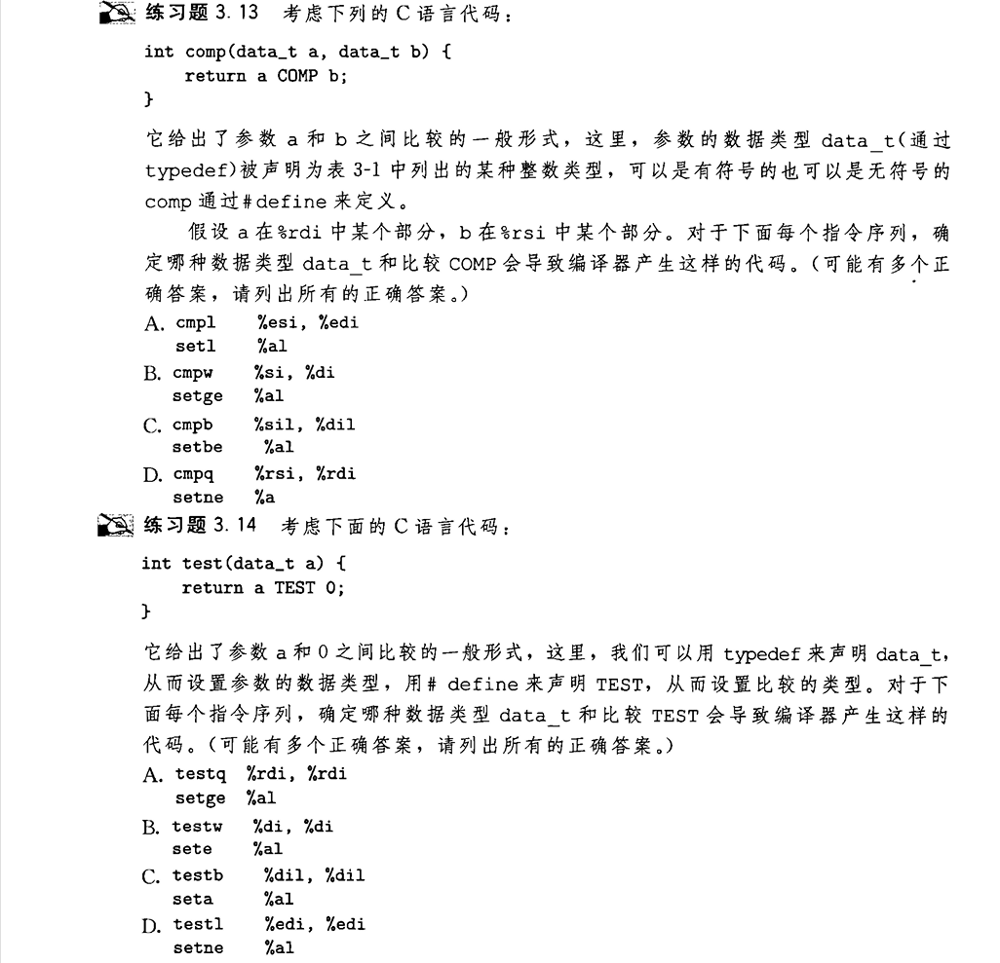

## 条件码寄存器
执行算术或逻辑运算[^1]时,这些寄存器会更新0或1[^2]
[^1]:`leaq`不会改变条件码
[^2]:但是这些寄存器是64位且只使用16位的,奇怪  

使用条件分支指令时 , 系统会根据这些寄存器内的值进行判断,书上给出了这些条件码:
- CF    --**`进位标志,操作使最高位溢出(适用于无符号数)`**
- ZF    --**`零标志,最近操作返回0`**
- SF    --**`符号标志,最近操作返回负数`**
- OF    --**`补码溢出`**

汇编程序员也可以直接调用这些指令(有后缀),**只改变条件码,不影响数值寄存器内的值**:
- cmp src1,src2
- test src1,src2  
   
cmp会计算`src2-src1` , 更新ZF或SF ; test会计算`src1&src2` , 也更新ZF或SF.
```
set dest
```  
  
set会根据条件码的内容,把dest寄存器的内容设置为0或1 , dest一般是单字节寄存器 , 如 `%al , %bl`  

---
### set 的后缀
set不同的后缀表示基于的条件码组合不同:
  
- sete setne
- sets setns
- setg setge setl setle
- seta setae setb setbe[^3]

[^3]:
    `e = equal   ne = not equal`   
    `s = sign     g = greater     l = less `   
    `a = above    b = below`  

---

## 宏推测




注:该图3.14 D:应该是
```
testl $edi, %edi
setle %al
```
写这两道题时注意指针即可