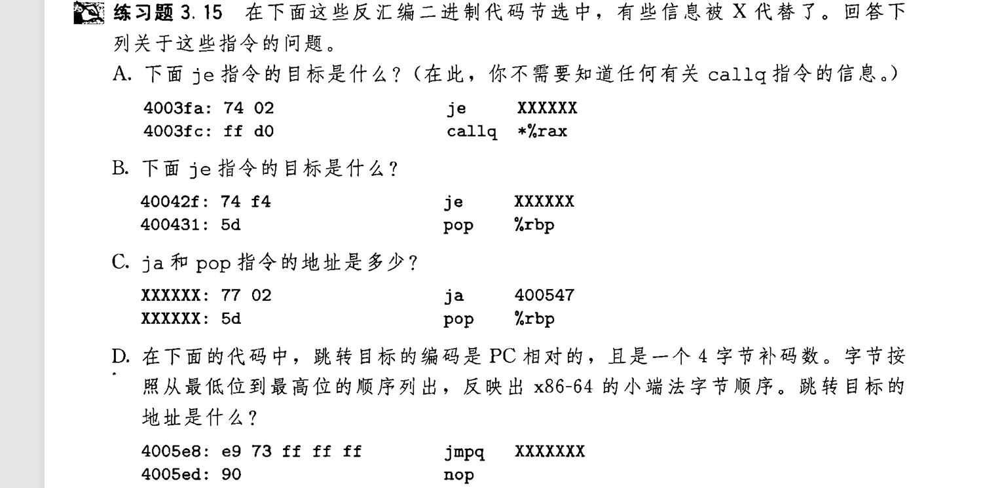

## 跳转指令
jmp指令用于汇编代码行的跳转 , 例如 `jmp .L1`
```
jmp label ; and or
jmp *operand ; 间接访问
```
jmp直接访问 , 可以类比C语言中的 `goto` 语句 , 使用的标签必须出现在某一行  
jmp间接访问 , 在你要读的寄存器或内存前加上 ` * `  

---

jmp还存在条件跳转[^1] , 即有` set `指令一样的后缀:
- je jne
- jms jns
- jg jge jl jle
- ja jae jb jbe  
[^1]:条件跳转只能使用标签  

## 跳转指令的机器码
以下是一段汇编文本:
```
    movq %rdi, %rax
    jmp  .L2
.L3:
    sarq %rax
.L2:
    testq %rax，%rax
    jg    .L3
    rep; ret 
```
转为机器码后:
```
0:   48 89 f8       mov    %rdi,%rax
3:   eb 03          jmp    8 <loop+0x8>
5:   48 d1 f8       sar    %rax
8:   48 85 c0       test   %rax,%rax
b:   7f f8          jg     5 <loop+0x5>
d:   f3 c3          repz retq
```
左边的`0: 3:`等表示该指令的地址 , `3:` jmp后面的操作数 **`03`** 记录了jmp要跳转的指令位置 , 将其与下一条指令的地址5相加可得到[^2] , 相加遵守有符号补码运算 , 如 `f8 + d = 5` 
[^2]:在计算jmp地址时加入下一条指令的地址 , 可提高移植性 , 使其在地址更换平移(在程序链接时会发生)时仍然有效.  
---
练习:  



这道题需要强大的补码运算能力 :worried:


[下一章](3.16_17_18-ifelse.md)