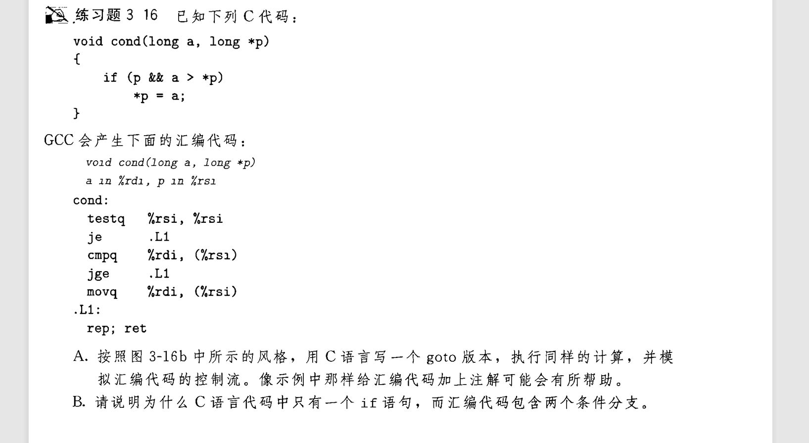

## goto 条件分支
汇编中可以使用jmp命令进行类似`goto`的跳转实现条件分支 , 例如:
```c
long gotodiff_se(long x, long y)
{
    //这种C代码可以直接逐字翻译为汇编
    long result;
    if (x >= y)     //使用 cmpq 和 jge
        goto X_ge_y;
    lt_cnt++;       //这里使用了(%rip) , 这是一个指令指针寄存器
    result = y - x;
    return result;
X_ge_y:
    ge_cnt++;
    result = x - y;
    return result;
}
```
上面第一个语句块 `lt_cnt++;  result = y - x;  return result;`属于` x < y ` , 下面属于`x >= y`

  

B. ~~C语言的if语句支持条件嵌套 , cmp 和 test 并不支持~~  
这不是主要原因哈 , 第一个条件分支是&&表达式实现的一部分。如果对p为非空的测试失败，代码会跳过对a>*p的测试，
### 另一种规则

笔者觉得这个看看就好  


## 反编译习题
这道题笔者觉得确实复杂 , 慢慢来.  
  
  

  
我是先先翻译成C的goto格式 , 再慢慢分析填空


[下一章](3.20_21-cond_transfer.md)