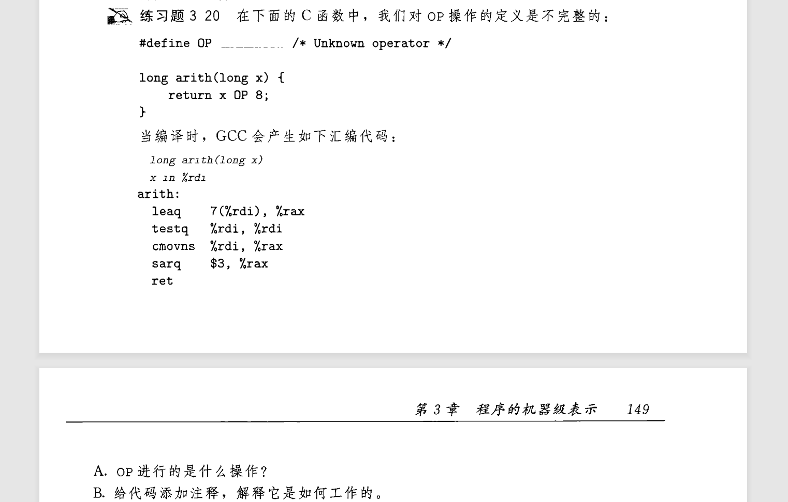
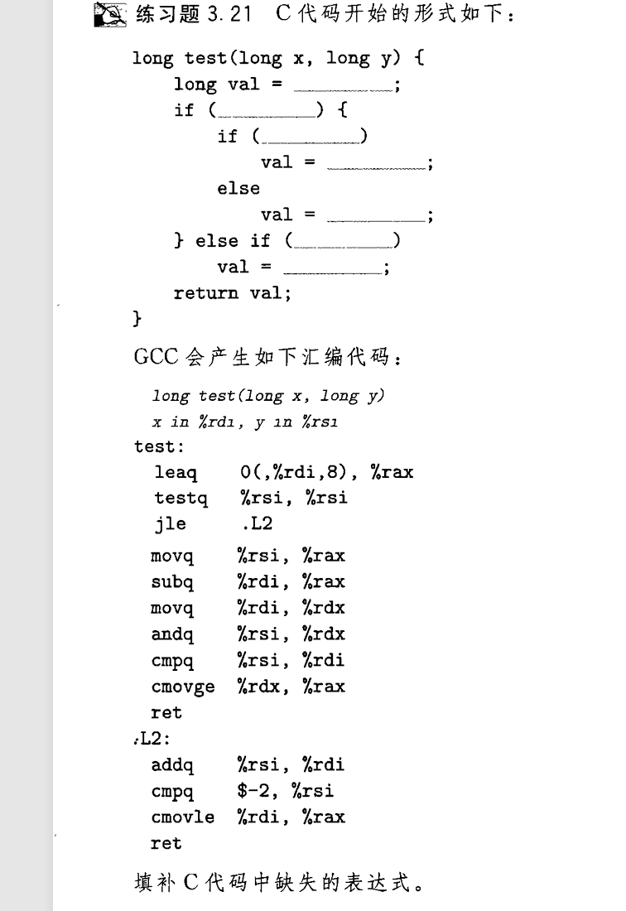

## 条件传送-分支
这一节介绍了一个实现分支语句的新思路:
- 提前执行每一个分支的操作 , 计算出需要保存的值
- 最后使用 **`cmov`** 通过条件码决定应该返回哪个分支计算的值  
   
先不论存在意义 , 单单看该方案 , 每一次都要执行所有分支的内容 , 必然不受推荐 . 确实 , 只有在计算内容不甚复杂的情况下 , GCC可能会使用这一结构:
```c
return a > b ? b : a;
```
书上对此方案进行了评价:它们只能用于非常受限制的情况,但是这些情况还是相当常见的,而且与现代处理器的运行方式更契合[^1]  
[^1]:详细请看csapp练习3.19附近的内容 , 正是因为符合处理器架构 , 该方案便有它自己的意义  
---
下面介绍cmov指令,cmov具有与 set 和 jmp 同样的[后缀](./3.13_14-cond_code.md#set-的后缀):
- cmove cmovne
- cmovs cmovns
- ...
```
cmov src, dest      ; src 和 dest 的意义与原mov一样 , 只是条件决定了要不要进行这一操作
```

---
## 对 cmov 的理解
  
  
    
这道题考察了负数移位的注意 , 即 负数 **必须加上偏移量 $2^k-1$** , 其中k为移位量 , 这样才能理解第一行的leaq指令  

## 写C语言吧! 
  
  

3.18会了 , 这个你就会 :smile: