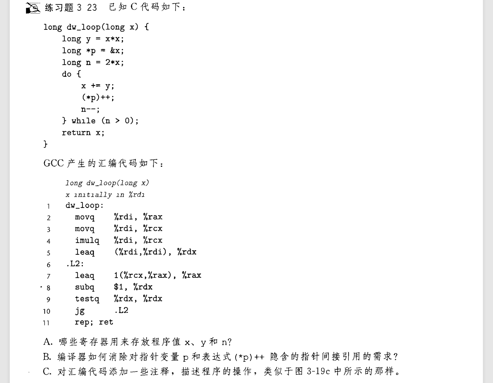
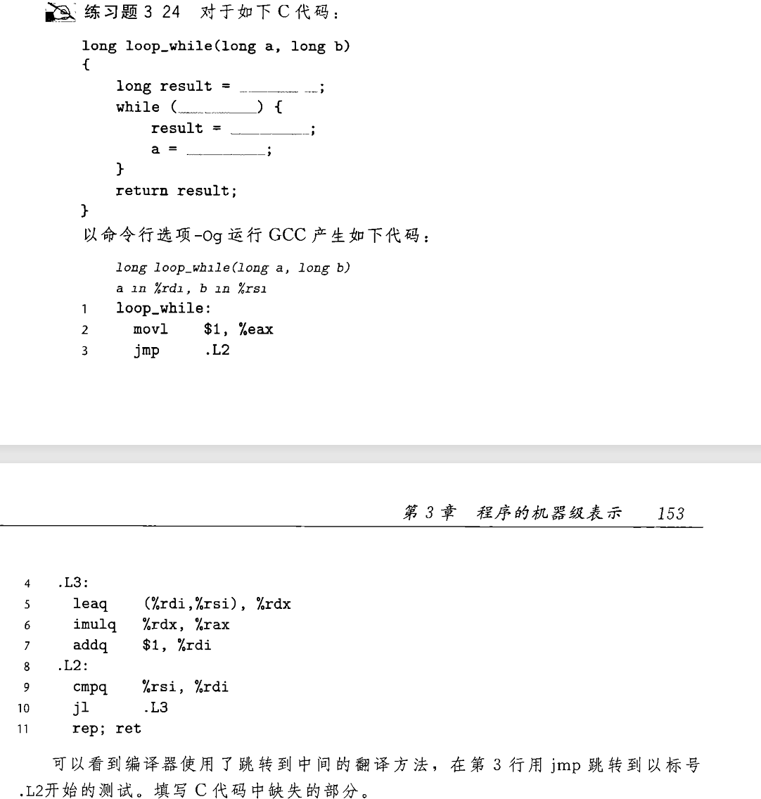
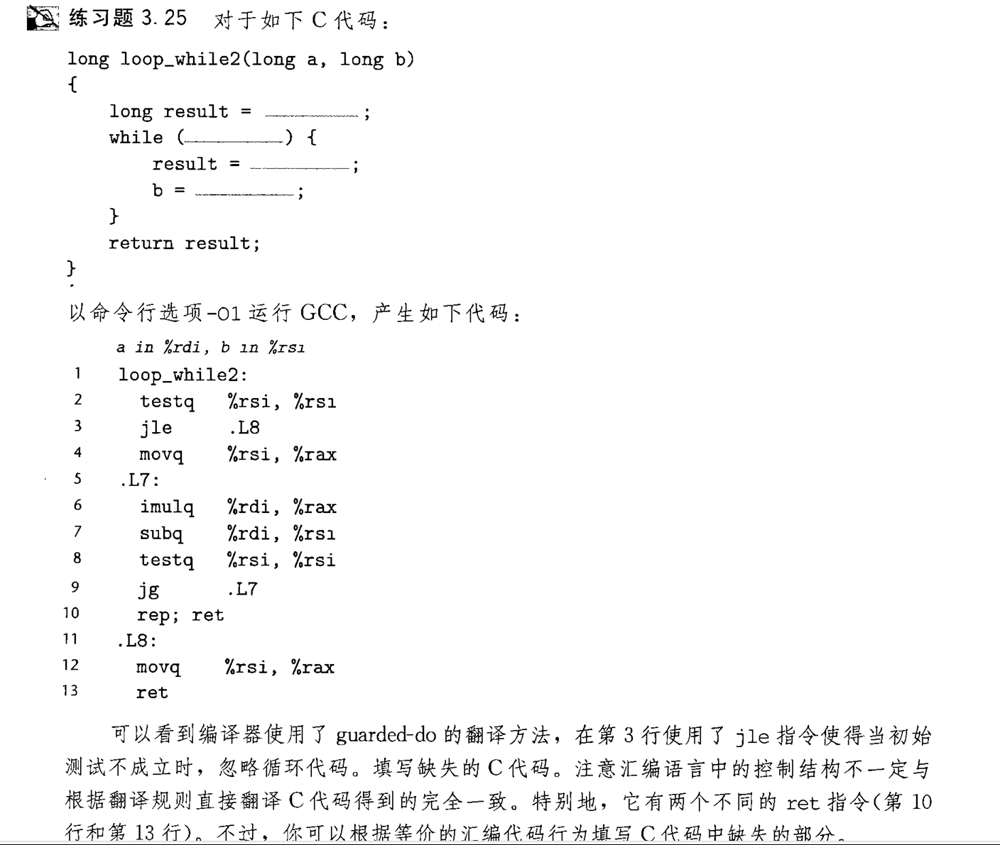
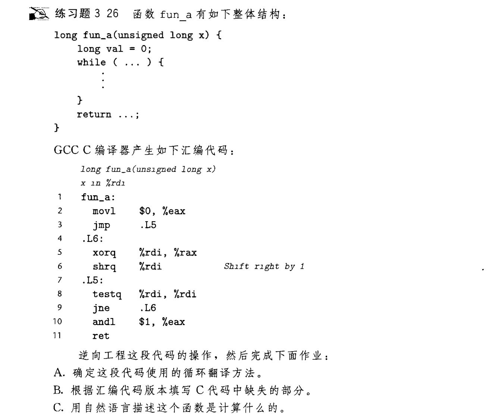
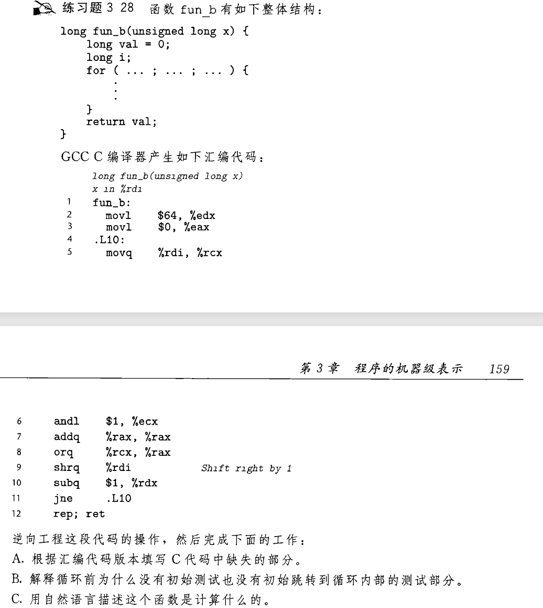
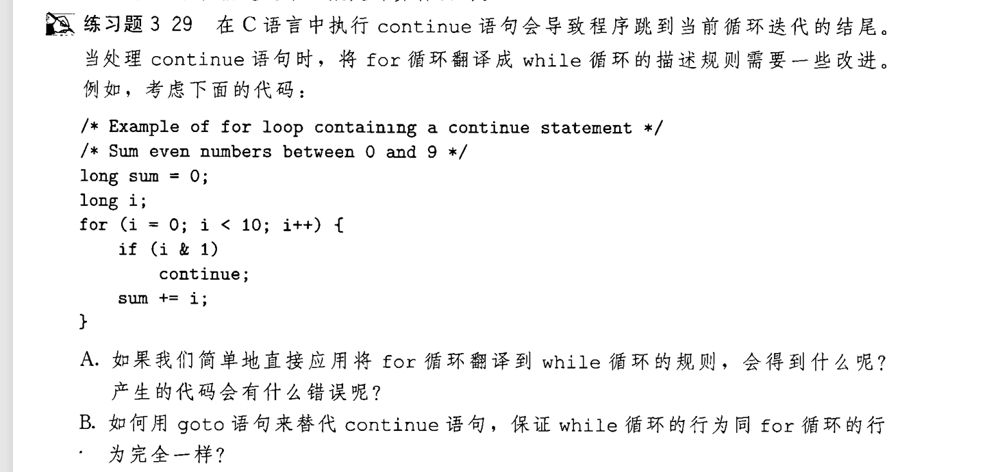

$练习3.22$
```
A. 用一个 32 位 int 表示 n! , 最大的n的值是多少?
B. 如果用一个 64 位 long 表示 , 最大的n的值是多少?
```
---
## 循环
汇编中,最好实现的是 `do-while` 循环:
```c
do{
    code;
}while(cond);
```
```
loop:
    code
    cmp cond
    jmp loop
```
是的 , 循环的底层大多基于这种复杂的跳转 , 后面我们会看到更复杂的 while 和 for . 不过现在写一道逆向吧!  
  


A. 慢慢分析 :smile:  
B. 直接对 x 的寄存器进行操作 , 因为指针 p 总是指向 x    
C. 其实分析题目的时候就应该写好( ) 

---
## while loop
while循环目前有多种实现 , 书中介绍两种 , 第一种叫做 *jump to middle* , 第二种叫做 [*guarded-do*](#guarded-do)  
下面介绍 第一种:
```c
while(cond){
    code;
}
```
```
    goto test
loop:
    code
test:
    cmp cond
    jmp loop
```


---
### guarded-do
我们知道do-while 循环和 while 循环之间存在简单的转化关系 , 所以我们在 `do-while` 的基础上进行更改就可以得到这种实现:
```
    cmp cond
    jmp next
loop:
    code
    cmp cond
    jmp loop
next:
    . . .
```

---

### guarded-do练习

### 综合?
  
A.   
  
B.
    
C. 这是一个很有意思的算法 , 代码实际上是把参数 x 的各个二进制位累加异或[^1] , 而我们只需要关注val值的最后一位[^2] , 就很容易发现这一点  
[^1]:如果 x 的值是 `abcd` (二进制位) 则最终结果是 **`a ^ b ^ c ^ d `** 
[^2]:代码最后将val的值 & 0x1 表明了只取最后一位    

那么把一个二进制数所有位累加异或干嘛呢 ? 我们知道异或是满足交换律和结合律的 , 故而位的顺序不重要 , 而`
1 ^ 1 = 0 , 0 ^ 0 = 0` , 如果 1 的个数是偶数 , 结果就是0 ; 1 的个数是奇数 , 结果就是 1 .于是知道了参数的奇偶性.

---

## for loop
我们知道 , for循环本质上是让while循环写起来更加简洁 , 所以我们也能转化 :smile:  
  
这里简略写一下C代码的转化:
```c
for( int i = 0 ; i < 10 ; i++ ){
    code
}
```
```c
int i = 0;
while(i < 10){
    code
}
```
练习3.27 就是把for -> while -> guarded-do 汇编 , 在此不表  
下面看看 3.28 和 3.29

### 逆向综合练习



A.
    
B. 编译器太强了 , 知道不需要提前测试 ,并且循环内部也没有test和cmp测试语句  
  
C. 将一个64位数的位反转过来

### continue 问题



A. i++ 被跳过了 , while里本来就会跳过 , 但是for里面不能跳过  
  
B. 在loop:标签后面先不进行cond的测试 , 先进行 i++