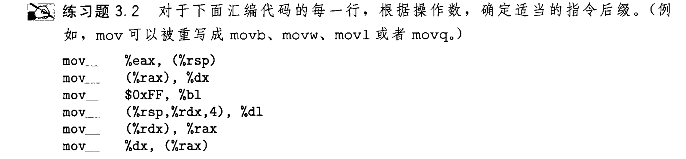
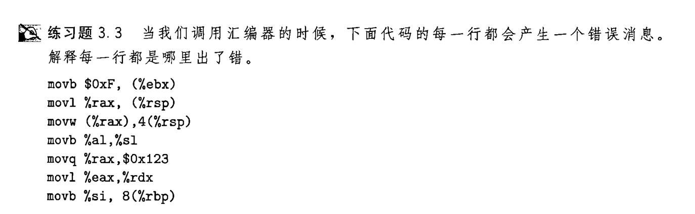

### 指令
先从数据传送指令 *mov* 开始   
```
mov src,dest  
```
mov的后缀判断:
- b 表示传输字节 *byte*
- w 表示传输字 *word*
- l 表示传输双字
- q 表示传输四字 *quad word*
- absq 可解码64位常数
- zbw 用零扩展将b传输到w *zero extension*
- sbw 用有符号扩展将b传输到w *signed extension*  
寄存器知识[^1]
[^1]:r开头为4字寄存器(64),e开头为2字寄存器(32),无开头1字寄存器(16),l结尾1字节寄存器(8)  

  

### 判断报错原因



知识点:
- 内存寻址时只使用64位寄存器名称 
- mov操作无法同时操作两个内存值,要有寄存器过渡
- dest不能是imm值
- 不同长度的寄存器传输时要指定z还是s
- 寄存器名称图如下:
