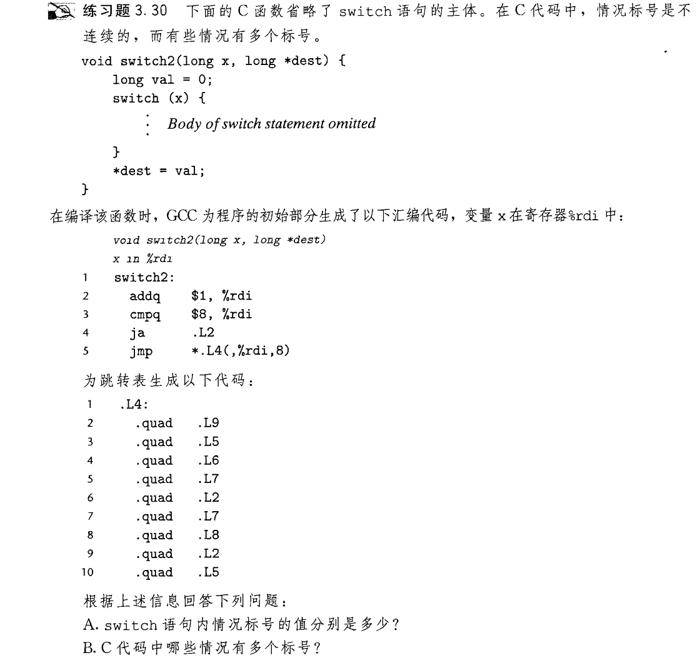
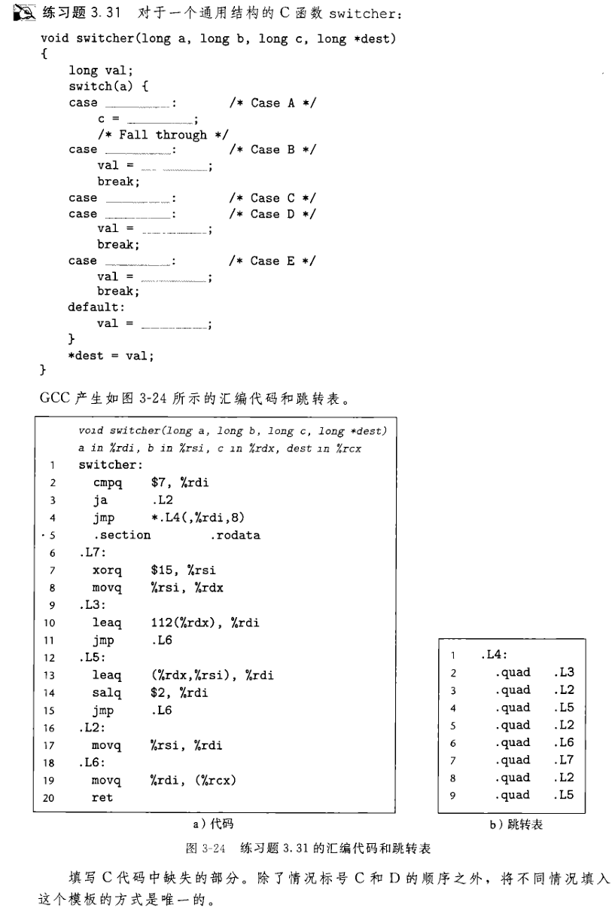

## 跳转表实现switch

现在到了 switch , 我们的武器还是只有跳转指令 :worried: , 众所周知 switch 可以无限分支下去 , 
于是出现一大堆跳转标签(唉唉没办法)  , 为了好好管理这些标签 , 引入一个叫跳转表的东西.  
跳转表其实就是一个标签数组 , 需要访问标签时 , 通过数组下标即可 , 声明如下:
```
.L4:
	.long	.L2-.L4
	.long	.L9-.L4
	.long	.L10-.L4
	.long	.L10-.L4
	.long	.L7-.L4
	.long	.L6-.L4
	.long	.L5-.L4
	.long	.L3-.L4
```
` -.L4 `表示其相对.L4数组首地址的偏移量 , 与书上不一样 , 因为受前面汇编代码的逻辑影响:
```
leaq	.L4(%rip), %rdx         ; .L4首地址存入 %rdx
movslq	(%rdx,%rdi,4), %rax     ; 根据 %rdi 和首地址获取标签地址存入%rax , 如 .L2-.L4 , 跳转表内是long 4字节
addq	%rdx, %rax              ; %rax = %rax + %rdx , 获取标签真正的地址
notrack jmp	*%rax               ; 跳转
```
原理大概就是数组 , 数组语法后面会介绍 , 我们先练习看标签吧!

## 根据跳转表反推switch

  

注意汇编代码里给参数加一 , 并且进行的是无符号比较 .


## 逆向练习



沉着 :smile: easy
  
这一节我们主要会读跳转表即可

[返回README](./README.md)
