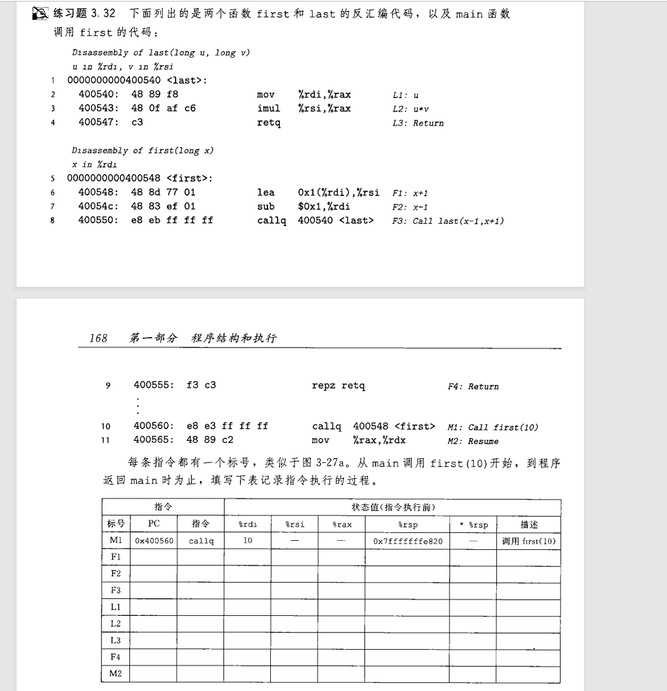
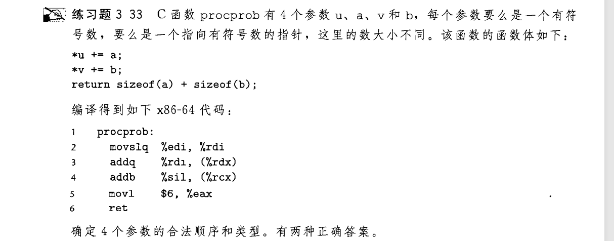
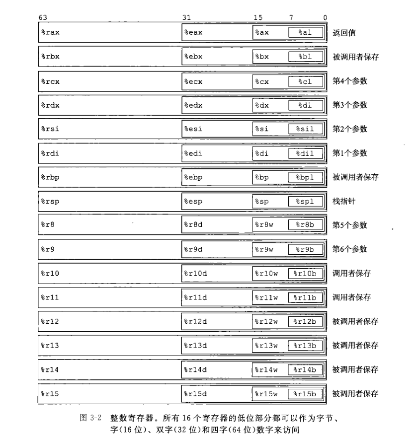
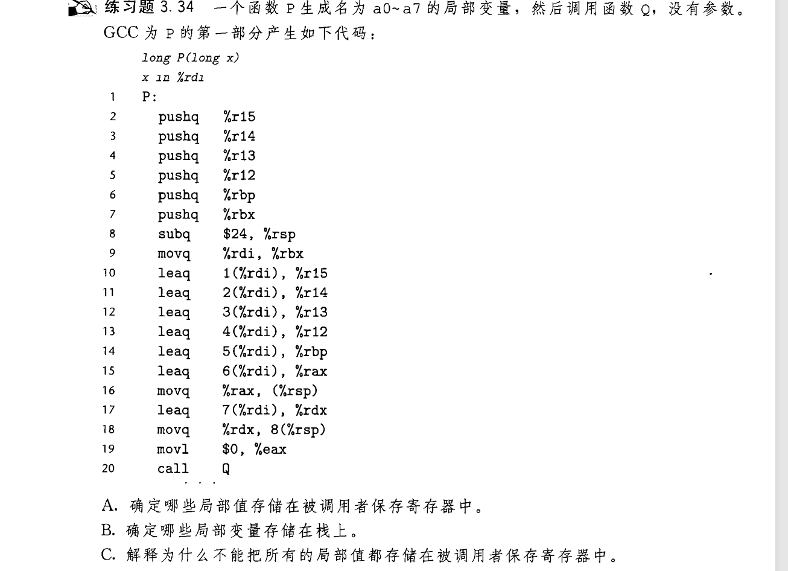
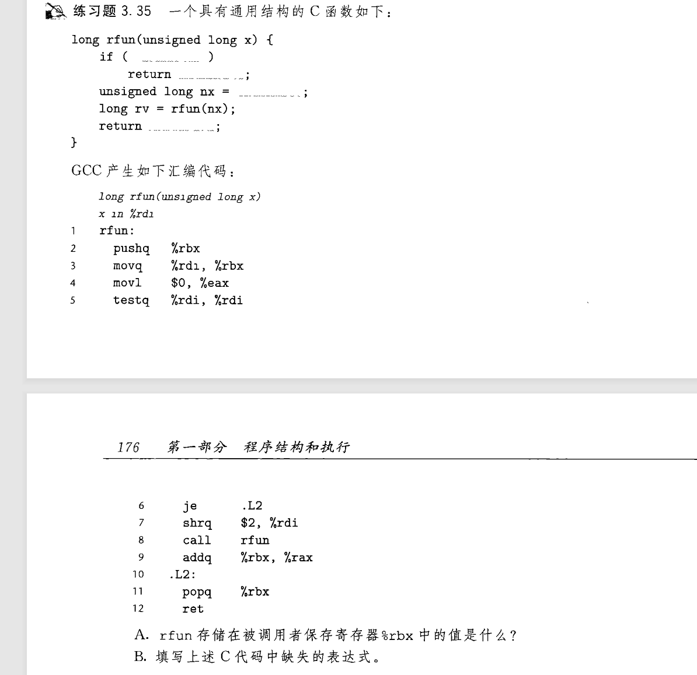

# 栈

栈(Stack) 是计算机科学中至关重要的一个数据结构 , 书中在本节写了很多栈相关的应用:


- [支持函数的调用和返回](#支持函数的调用和返回)		
- [储存函数中超过六的参数](#储存函数中超过六的参数)
- [储存局部变量](#储存局部变量)
- [保存在多重函数调用下重复使用的寄存器原值](#保存在多重函数调用下重复使用的寄存器原值)
- [支持函数递归](#支持函数递归)

栈本身是一个具有后进先出限制的线性表 , 实现该数据结构一般要有 `push`(压栈) , `pop`(出栈) 等操作.  
C 和 Java 语言的函数调用过程便是基于栈 , 开始main函数入栈 , 如果调用其他函数 , 该函数入栈 , 执行完毕则出栈 , 继续执行main  
书中 3.7 主要讲的是 汇编语言的多函数相互调用过程中栈的应用

---

## 支持函数的调用和返回

当我们写C语言中调用了函数时 , 汇编代码会出现call指令 , 如:
```c
//main.c
long add(long a, long b) {
    return a + b;
}

int main(){
    long a = 1;
    long b = 2;
    long result = add(a, b);
    return result;
}
```
使用 `-Og`选项编译: `gcc main.c -o main -Og` , `objdump` 生成 汇编代码
```
0000000000001129 <add>:
    1129:	f3 0f 1e fa          	endbr64 
    112d:	48 8d 04 37          	lea    (%rdi,%rsi,1),%rax
    1131:	c3                   	ret    

0000000000001132 <main>:
    1132:	f3 0f 1e fa          	endbr64 
    1136:	be 02 00 00 00       	mov    $0x2,%esi
    113b:	bf 01 00 00 00       	mov    $0x1,%edi
    1140:	e8 e4 ff ff ff       	call   1129 <add>
    1145:	c3  
```
可以看到call指令的形式为
```
call src    
```
汇编中只显示 `call add` , 反汇编生成 `call 1129<add>` , 1129为add函数指令的首地址  
从底层看 , call 指令 将程序计数器[^1]跳转到 src 的位置 , 同时将原函数下一条指令的地址(1145)压入栈中  
[^1]:程序计数器(program counter , 简称 PC)存放下一条需要执行指令的地址 , 如 1132 1145 此类地址  
### 栈指针寄存器
%rsp register stack pointer 是汇编语言对栈操作的重要寄存器 , 上文代码里使用的call指令实际上对%rsp进行了操作
```
movq $0x0000000000001145 , (%rsp)
subq $0x8 , %rsp    ; 压入的是8字节的地址
```


注意十六进制 :smile:

---

## 储存函数中超过六的参数

当函数调用中参数超过六[^2]时 , 我们需要在调用前把多出的参数压入栈[^3]中 , 之后在另一个函数调用中直接访问栈中的数据  
[^2]:%rdi %rsi %rdx %rcx %r8 %r9 , 这六个寄存器可以保存函数参数  
[^3]:先压入高位参数 , 如有八个参数 , 先压入第八个 , 再压第七个 , 再压入返回地址  

例如这个C函数:
```c
void proc(long a1, long *a1p,
          int a2, int *a2p,
          short a3, short *a3p,
          char a4, char *a4p){
    *a1p += a1;
    *a2p += a2;
    *a3p += a3;
    *a4p += a4;
}
```
```asm
    movq	16(%rsp), %rax      ; 从栈中取出 8 字节的 char* a4p
    addq	%rdi, (%rsi)
    addl	%edx, (%rcx)
    addw	%r8w, (%r9)
    movl	8(%rsp), %edx       ; 从栈中取出 1 字节的 char a4
    addb	%dl, (%rax)
    ret
```
为了方便内存访问 , 所有压入的数据统一为 8 字节 , 取出参数可以使用这样的语句:
```
movl (%rsp, %rax, 8) , %rdi
```
%rax为1 , 表示取出第七个参数到%rdi  
%rax为2 , 表示取出第八个参数到%rdi  
当然这是压入了返回地址的情况 , 有时候返回地址已经弹出 , 直接使用 (%rsp)访问参数  

  

虽然这个和我们讲的没啥关系 , 但是写起来逻辑性还是很强的 , 注意寄存器的变化和第一行的扩展语句到底在干嘛  

---

## 储存局部变量

当函数调用过程中, 定义了很多变量, 寄存器不够用了, 可以减小栈指针, 将变量储存在栈中, 如下情况会使用栈:  

- 寄存器不足
- 对局部变量使用 `&` 运算符获取地址 , 此时必须把它放在内存(栈)中
- 变量是数组或者结构体 
我们主要观察第二点 , 先看看书上的例子:
```c
long call_proc()
{
    long x1 = 1;int x2 = 2;short x3 = 3;char x4 = 4;
    proc(x1, &x1, x2, &x2, x3, &x3, x4, &x4);
    return (x1 + x2) * (x3 - x4);
}
```
`gcc file.c -S -Og -o file.S` 得到:
```asm
    subq	$40, %rsp       ;留出40字节空间
	movq	%fs:40, %rax    ;栈保护(金丝雀法)
	movq	%rax, 24(%rsp)  ;压入金丝雀值
	xorl	%eax, %eax      ;清空%rax
	movq	$1, 16(%rsp)    ; long 
	movl	$2, 12(%rsp)    ; int
	movw	$3, 10(%rsp)    ; short
	movb	$4, 9(%rsp)     ;为局部变量分配栈空间
	leaq	12(%rsp), %rcx
	leaq	16(%rsp), %rsi
	leaq	9(%rsp), %rax
	pushq	%rax
	pushq	$4
	leaq	26(%rsp), %r9
	movl	$3, %r8d
	movl	$2, %edx
	movl	$1, %edi
	movl	$0, %eax        ;传递函数参数到寄存器和栈上
	call	proc@PLT
	movslq	28(%rsp), %rax
	addq	32(%rsp), %rax
	movswl	26(%rsp), %edx
	movsbl	25(%rsp), %ecx
	subl	%ecx, %edx
	movslq	%edx, %rdx
	imulq	%rdx, %rax      ;进行计算, 结果保留到%rax
	addq	$16, %rsp       ;前面有两次push, 调整栈指针
	movq	24(%rsp), %rdx  ;取出金丝雀值到%rdx
	subq	%fs:40, %rdx    
	jne	.L4                 ;检测金丝雀值是否被修改 , 是则跳转到.L4(call函数 '__stack_chk_fail' )
	addq	$40, %rsp       ;回退40字节空间
	ret                     ;return (x1 + x2) * (x3 - x4);
```
我发现得到的结果与书上的代码很多不一致 , 提出几个我现在还是疑惑的问题  

- 为啥留出40字节空间 ?
- 栈保护的知识
- 为啥这里用的是push , 而不是直接像书上那样访问修改栈内存 ?
- 为啥留出了40字节, 压入数据时从32-24 区域开始 , 之前8个字节留出来干什么

之后弄懂了笔者会另写文档解答 , 我们先关注眼下的知识点  
即: 压入函数参数时需要8字节对齐 , 压入局部变量**直接按内存顺序**放置 , 不对齐 

---

## 保存在多重函数调用下重复使用的寄存器原值

再看通用寄存器表:
  
  
讲讲表中的 `被调用者保存` `调用者保存` 两类寄存器

### 被调用者保存
被调用者保存 callee saved 书上给予这样的解释:  
```
当过程 P调用过程Q时，Q必须保存这些寄存器的值，保证它们的值在Q返回到P时与Q被调用时是一样的。    
过程Q保存一个寄存器的值不变，要么就是根本不去改变它，要么就是把原始值压入栈中，改变寄存器的值，然后返回前从栈中弹出旧值。
代替原寄存器 保存其值 压入栈中的寄存器就是 被调用者保存寄存器  
```
这是一个庞大的家族 %rbx %rbp %r12 - %r15  
如果编译时不加 `-Og` 优化 , 啥函数编译器都会先给你来一个 `push %rbp` 然后把栈指针转移到上面, 比如:
```c
long add(long a,long b,long c){
    return a + b + 1;
}
```
```asm
add:
	pushq	%rbp            ;压入%rbp
	movq	%rsp, %rbp      ;将栈指针保存到%rbp
	movq	%rdi, -8(%rbp)  
	movq	%rsi, -16(%rbp)
	movq	%rdx, -24(%rbp) ;实则是用%rbp引用栈指针 , 往栈中压入变量
	movq	-8(%rbp), %rdx
	movq	-16(%rbp), %rax
	addq	%rdx, %rax
	addq	$1, %rax        ;计算 a + b + 1
	popq	%rbp            ;弹出%rbp
	ret
```
这么简单的函数,编译器给你拉依托这种东西出来, 但我们先不论这是什么鬼 , 简单分析一下:噢上面注释分析完了嘻嘻  
我们还是看一个更实用的例子:
```c
long Q(long x)
{
    return x + 2;
}
long P(long x, long y)
{
    long u = Q(y);
    long v = Q(x);
    return u + v;
}
```
```asm
Q:
	leaq	2(%rdi), %rax
	ret
P:
	pushq	%rbp
	pushq	%rbx
    ;这里理应要栈指针减8 , 对齐栈帧
	movq	%rdi, %rbp
	movq	%rsi, %rdi		; 要调用 Q(y) 先存放x到%rbp中, y移动到%rdi, 作为Q的第一个参数
	call	Q
	movq	%rax, %rbx		; 要调用 Q(x) 返回值会覆盖原来的%rax , 先存放到%rbx中
	movq	%rbp, %rdi		; 取出之前存放的x, 放到%rdi作为第一个参数
	call	Q
	addq	%rbx, %rax		; 两个返回值相加, 完成计算
    ;这里理应要栈指针加8 , 与上文对应
	popq	%rbx
	popq	%rbp
	ret
```



### 调用者保存

调用者保存 caller saved 书上给予的解释不全 , 先搁置

## 支持函数递归 

递归本质上是多次跳转到同一函数的地址进行指令的运算 , 但是每一次调用时函数的参数肯定不一样 , 所以我们需要在每一次调用前压入当前递归函数参数的状态 , 使用被调用者保存寄存器  
书上给出了阶乘函数的例子 , 这是极好的:
```c
long rfact(long n)
{
    long result;
    if (n <= 1)
        result = 1;
    else
        result = n * rfact(n - 1);
    return result;
}
```
```asm
rfact:
	endbr64
	cmpq	$1, %rdi
	jg	.L8					; 判断递归出口
	movl	$1, %eax		; 满足条件直接退出递归
	ret
.L8:
	pushq	%rbx			;开始递归 , 压入%rbx
	movq	%rdi, %rbx		;保存这次递归的参数n到%rbx
	leaq	-1(%rdi), %rdi	; n = n - 1
	call	rfact			
	imulq	%rbx, %rax		;result = result * n
	popq	%rbx			; n 出栈
	ret
```
如果 n = 4 整个递归过程一共往栈中压入了3个n : 4 3 2 ;  
执行到 `imulq	%rbx, %rax`行时 , 先是 1 * 2 , 弹出2 , 再 2 * 3 , 弹出3 …………  
故而多次递归会导致栈中存放的状态值过多 , 导致爆栈  

    
慢慢写 , 挺简单的 :smile: