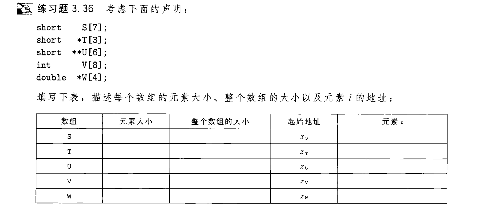
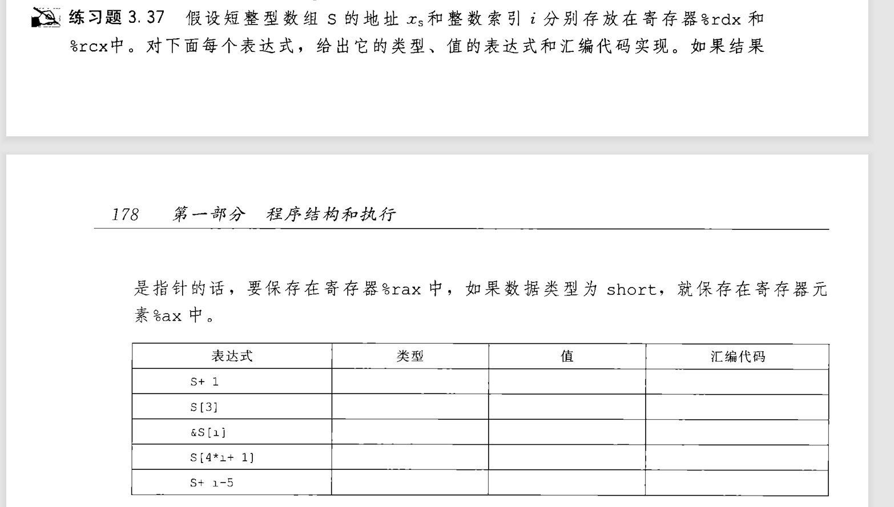
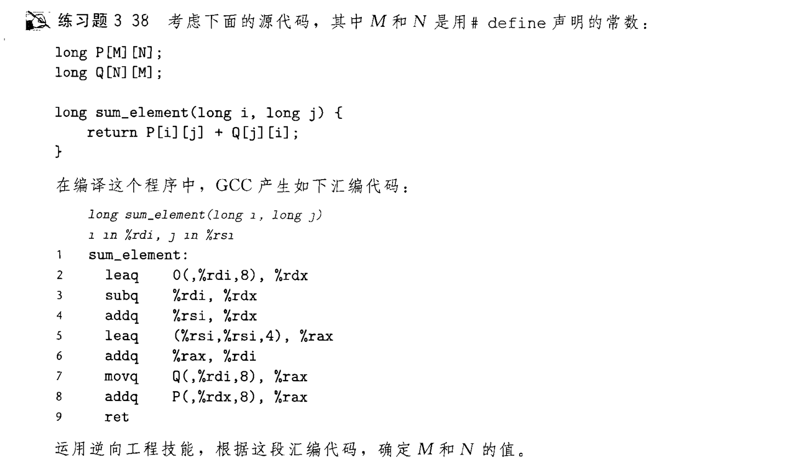
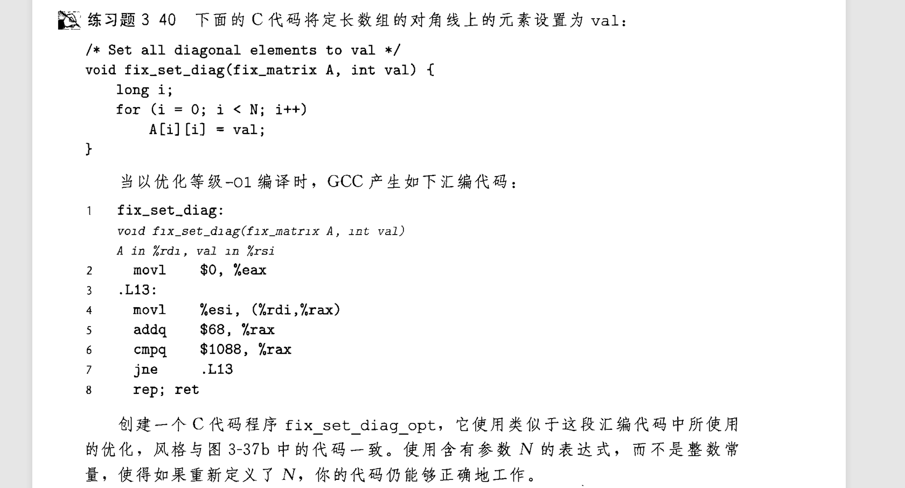

## 数组

数组是一种线性表 , 其元素在内存中是连续存放的 , 故而在汇编中表示也算简单  
  

数组和指针的运算有很大的关系, 我们访问数组中的一个元素 arr[4] 实际上就是访问 ` *(arr + 4) `    
  
熟悉指针的加减法运算的话, 指针运算加 N 会视为 地址加上 N * Typebyte , 后者为指针指向数据的字节数 如int的为4  
  
汇编代码的操作数提供了方便计算的[方法](./3.1-operand.md) , (arr, index, typebyte)操作数即可访问到相应的数据  
  

  

题中'值' 用 $x_s, i, M$ 表示 M表示内存这个超大数组  

## 二维数组

书中又讲了许多二维数组的知识 :

- [二维数组的定义和元素访问](#二维数组的定义和元素访问)
- 宏定义--定长数组 
- 变长数组
- 编译器对数组运算的优化
  
考虑到二维数组过于抽象(存疑) , 我们直接用之前的基础看题:





3.39自行查找  
### 二维数组的定义和元素访问

假如有二维数组 :
```c
int arr[3][4];
int array[M][N];
```
我们要计算 arr[i][j] 本质上是计算 ` *(arr + i * 3 + j) `  对于内存, 计算 ` M[ arr + 4 * (i * 3 + j) ]  `
   
同样的, 我们要计算 array[i][j] 本质上是计算 ` *(arr + i * M + j) ` 对于内存, 计算 ` M[ arr + 4 * (i * M + j) ]  `