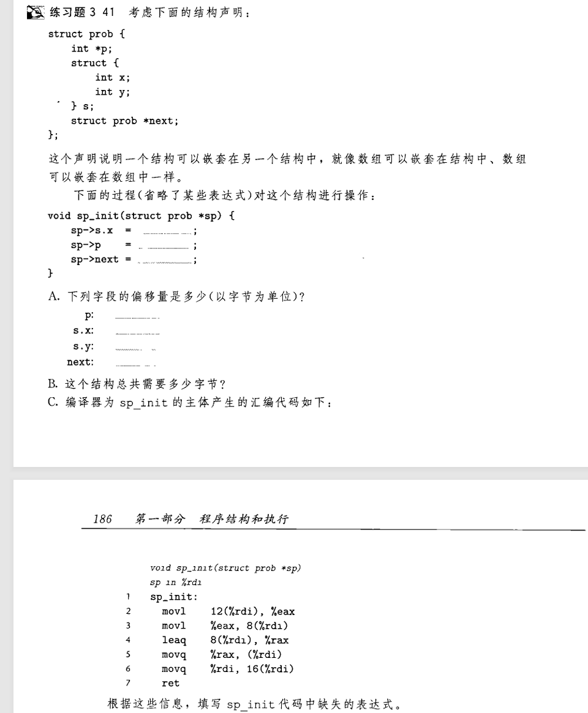
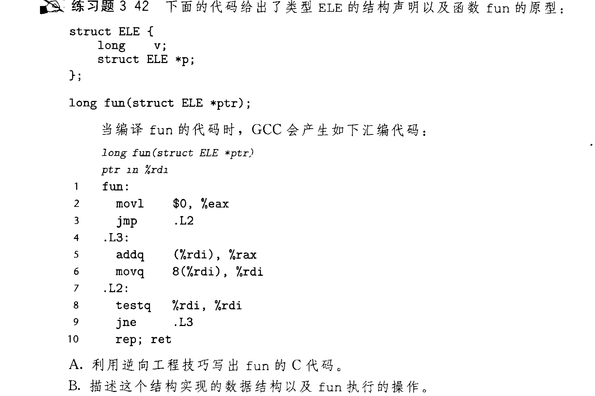
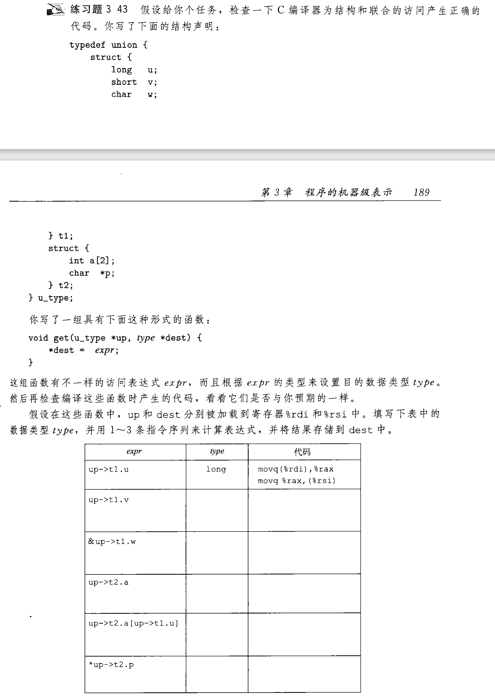
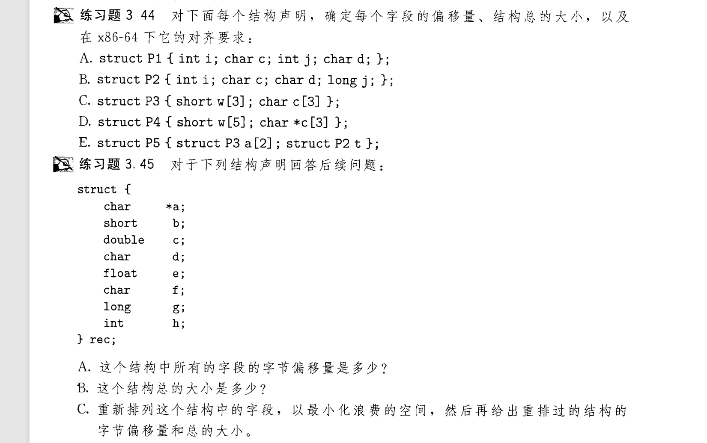

# 数据结构

我们定义数据结构时, 结构体和联合体是比较重要的东西, 这一节讲解了汇编中这些结构的编译和底层中存在的'内存对齐'现象

- [结构体](#结构体)
- [联合体](#联合体)
- [内存对齐](#内存对齐)
- [枚举](#枚举)

## 结构体

结构体在C语言中的细节我们不再叙述, 在汇编中, 结构体也是内存连续存放的, 因此要访问结构体的成员, 对结构体的指针加上相应的偏移量即可  
  
汇编中不存在结构体这种东西, 一切处理由编译器进行  


  

B. 这是一个链表, 函数的作用是求和所有元素

## 联合体

联合体 union , 在C语言中声明如下
```c
union Data {
    int i;
    long f;
    char s[6];
};
```
其初始化规则和struct一致, 我们这里仅讲讲从汇编和底层的角度看, union的这些性质是哪来的  
  
汇编中不存在联合体这种东西, 一切处理由编译器进行  
你访问联合体的任意一个成员时, 都是从首地址开始读取数据, 例如:
```c
//假设联合体指针存放在%rdi中, C代码用不规范的写法Data.i 和 %rax

%rax = Data.i ;  ->  movl (%rdi), %eax
%rax = Data.f ;  ->  movq (%rdi), %rax
%rax = Data.s ;  ->  movq %rdi, %rax
%rax = Data.s[0]; -> movb (%rdi), %al
%rax = Data.s[3]; -> movb 3(%rdi), %al
```   

书上还讲解了一些联合体在数据处理中的应用, 如为构建某特殊二叉树提供内存节约, 提供位模式不变的强制类型转换[^1], 在此不表自行了解  
[^1]: 如果直接进行double到unsigned long 的转换, 系统只会读取double的52位整数部分数据, 赋到ulong的二进制位中  

  

写这个的时候你的汇编代码可能会与答案不一致, 可以尝试弄清原因, 但是关键是要弄清这个转换的过程

## 内存对齐

许多计算机系统对基本数据类型的合法地址做出了一些限制，要求某种类型对象的地址必须是某个值K(通常是2、4或8)的倍数。这种对齐限制简化了形成处理器和内存系统之间接口的硬件设计, 
无论数据是否对齐，x86-64硬件都能正确工作。不过，Intel还是建议要对齐数据以提高内存系统的性能。对齐原则是任何K字节的基本对象的地址必须是K的倍数。
对齐原则主要应用在结构体上, 例如:
```c
struct S {
    int i;
    int j;
    char c;
 };
```
实际上占12字节 , 因为当生成结构体数组时, 为了保证后面的元素也对齐, 必须在 char c 的后面再补上三个字节  

  

知识点:  

- 出现结构体嵌套时, 考虑对齐结构体内存的时候不需要代入结构体的整个内存, 
比如3.44 E. 中的 P2 t 成员, 其占16字节, 不是说 P5 一定要按照16字节对齐,
因为结构体本身是在汇编和底层不存在的, 不需要当作一个整体, 我们应该找到满足
其成员对齐的最小值.

- 3.45 C. 题目写的时候尽量考虑把小字节的数据顺序放在一起, 可以找到答案, 有兴趣可以实现一个找最小空间的算法 :smile:

### 神秘对齐规则

- 任何内存分配函数(alloca、malloc、calloc或 realloc)生成的块的起始地址
都必须是16的倍数。
- 大多数函数的栈帧的边界都必须是16字节的倍数
- 调用call前的栈指针必须是16字节的倍数(上面那个规则的直观表达) 
- 刚进入函数调用时,栈指针一般不是对齐的,因为call压入了8字节的返回地址,开始栈指针需要减一定的数值x[^2], x不是16的倍数而是8的倍数.  
[^2]:这个减小栈指针的操作不一定是 subq , 也可以是 push %rbp 此类

## 枚举


[回到顶部](#数据结构)