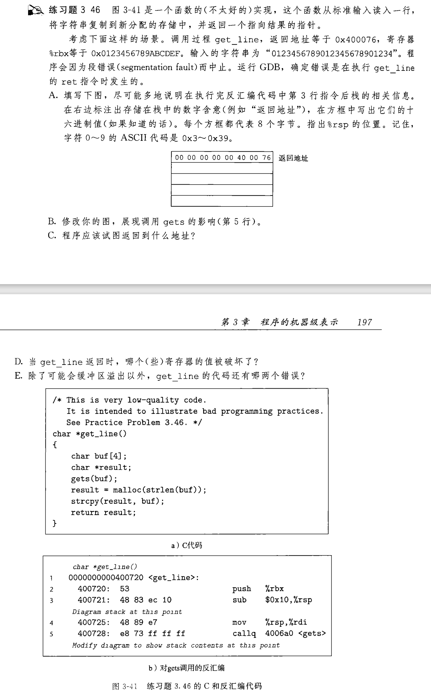
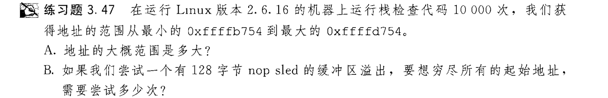
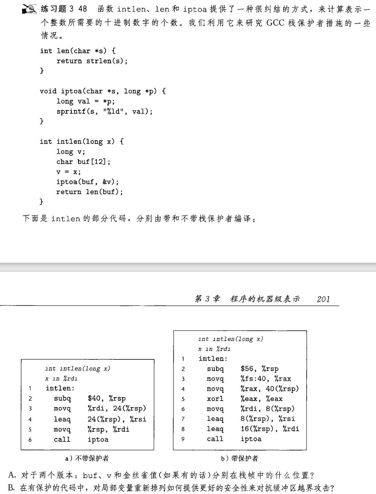
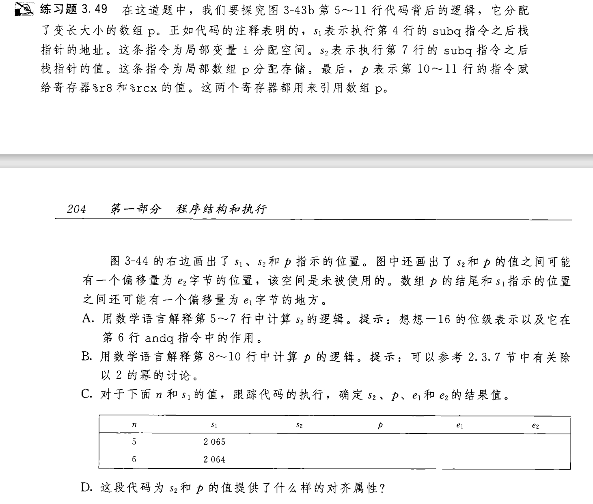

## 缓冲区溢出

在编写C语言程序的时候, 如果越界访问数组, 程序就会出一些问题. 学习了汇编我们发现C编译器对数组引用不作边界检查,
并且一般数组是直接存放在栈里面的, 如果越界访问, 可能会破坏栈里面储存的信息(函数调用返回地址,%rbp等等)  
书上对这一情况举了 ` gets() `函数的例子, 请自行参阅.




## 对抗缓冲区溢出

书上就网络安全方面列举了一些缓冲区溢出的危害, 我们看看就好. 接下来我们继续了解对抗这一危害的方法:

- [栈随机化](#栈随机化)
- [栈破坏检测](#栈破坏检测)
- [限制可执行代码区域](#限制可执行代码区域)


### 栈随机化

栈随机化是一种通过随机化栈的布局来对抗缓冲区溢出攻击的方法。具体来说，它会在每次程序运行时随机改变栈中变量的地址，从而使攻击者难以预测返回地址的位置。
我们可以随便写一个C程序来演示这一点。
```c
#include <stdio.h>
int main() {
    int a = 5;
    int* p = &a;
    printf("%d\n", *p);
    return 0;
}
```
多次执行该程序，观察输出结果，可以发现每次运行时，变量`a`的地址都是不同的。这就是栈随机化的效果。



128字节的缓冲区溢出表示, 每次攻击可以访问128字节的栈空间, 只要访问到了对应地址就会成功

### 栈破坏检测

栈破坏检测是一种通过在栈中插入特殊值来检测缓冲区溢出攻击的方法。这些特殊值被称为“保护值”或“哨兵值”，它们用于标记栈的边界。在函数返回之前，程序会检查这些保护值是否被修改，如果被修改了，就说明发生了缓冲区溢出攻击。

我们可以回去看看[3.7节文档的源码](./3.32_3.35-stack.md#储存局部变量), 这里就出现了栈保护的情况, 编译器额外为金丝雀值分配了一段空间,   
并使用`movq %fs:40, %rax` `movq %rax, 24(%rsp) `将金丝雀值压入栈内, 最后代码的后段弹出金丝雀值与原来的进行比较, 如果不相等会返回栈错误  



#### 40字节问题解答

问题来自于[3.7节文档](./3.32_3.35-stack.md#储存局部变量)
如果编译中禁用栈保护 `-fno-stack-protector` ,我们会发现编译器就分配了24字节的栈空间:
```asm
call_proc:
	subq	$24, %rsp       ;留出40字节空间
	movq	$1, 8(%rsp)
	movl	$2, 4(%rsp)
	movw	$3, 2(%rsp)
	movb	$4, 1(%rsp)     ;为局部变量分配栈空间
	leaq	4(%rsp), %rcx
	leaq	8(%rsp), %rsi
	leaq	1(%rsp), %rax
	pushq	%rax
	pushq	$4
	leaq	18(%rsp), %r9
	movl	$3, %r8d
	movl	$2, %edx
	movl	$1, %edi
	movl	$0, %eax        ;传递函数参数到寄存器和栈上
	call	proc@PLT
	movslq	20(%rsp), %rax
	addq	24(%rsp), %rax
	movswl	18(%rsp), %edx
	movsbl	17(%rsp), %ecx
	subl	%ecx, %edx
	movslq	%edx, %rdx
	imulq	%rdx, %rax
	addq	$40, %rsp
	ret
```
同样空出了8字节, 这是为了栈帧对齐, 可是为啥这8字节不能放金丝雀值呢  
| 栈空间   |   40-32   | 32-24|24-16|16-12|12-10|10-9|9-0|
|   -- |  -  | -|-|--------|----------|---------|--------|
|不禁用|null|canary|long|int|short|char|null|
|  栈空间 |  24-16|16-8   |8-4    |4-2    |2-1    |1-0|
|禁用| null | long  | int  |short | char  | null  |

不禁用栈保护的话, 编译器一开始并不打算压入多出的函数参数, 先预留空间  
(deepseek告诉我们,40字节是综合考虑后的最优解，而非最小理论值。这是编译器智能决策的典型例子, 去看gcc源码(bushi))

### 限制可执行代码区域

这个挺简单, 利用缓冲区溢出进行攻击肯定需要可执行文件, 程序只需要规定特定的内存段才能执行可执行文件即可, 并且这个地方最好不是容易发生栈溢出的地方 :smile:

## 神秘%rbp

使用变长数组时, 如使用malloc进行内存分配, 编译器难以确定栈空间的分配, 即不能直接计算出栈指针应该减去多少, 留出多少空间.  
```C
long vframe(long n,long idx,long *q)
{
	long i;
	long *p[n];
	p[0]=&i;
	for(i=1;i<n;1++)
		p[i] = q;
	return *p[idx];
}
```
编译器会通过一长串汇编代码留出 8n 字节的空间, 而不是直接使用subq命令  
为了管理变长栈帧，x86-64代码使用寄存器rbp作为帧指针(frame pointer)(有时称 为基指针(base pointer),这也是 `%rbp` 中bp 返回地址 两个字母的由来)。  
我们在之前[栈的文档](./3.32_3.35-stack.md#被调用者保存)里, 见过%rbp的使用, 也是保存栈指针%rsp的.  
具体这个数组 8n 空间如何分配, 请看练习题
