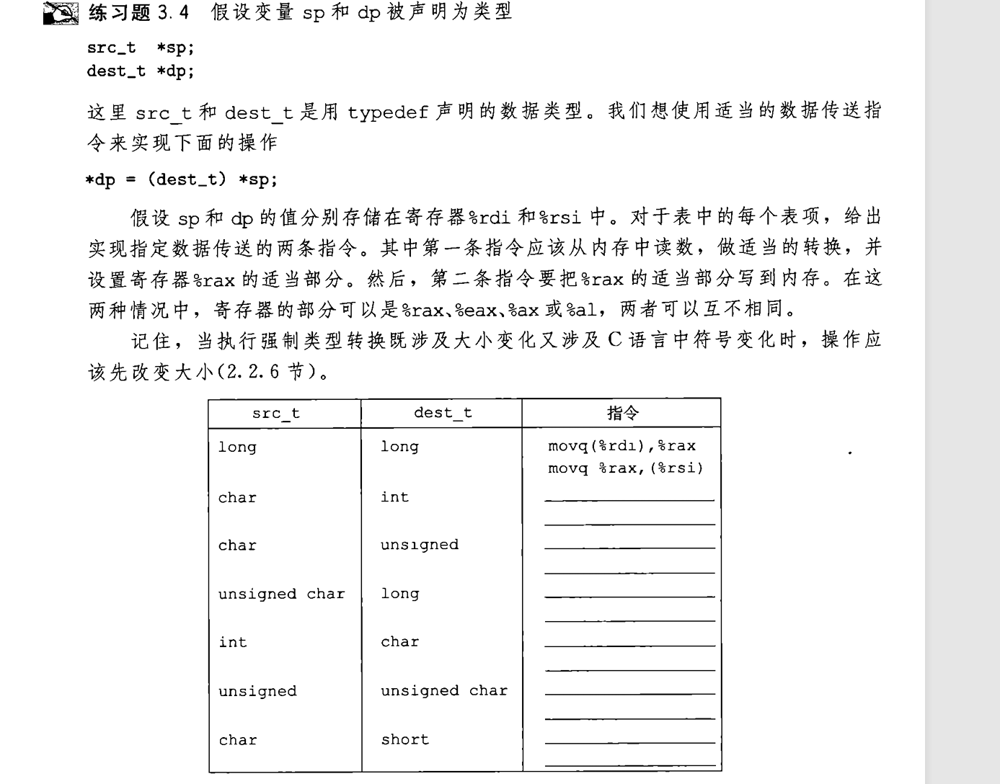
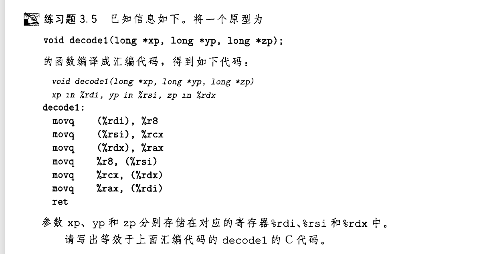

## 类型转换语句
下列C代码:
```c
long exchange(long *xp,long y)
 {
    long x =*xp;
    *xp = y;
    return x;
 }
 ```
 经过编译器生成:
 ```nasm
 exchange:
    movq (%rdi), %rax
    movq  %rsi, (%rdi)
    ret
```
代码中特定寄存器储存函数形参及返回值,以下为分析:
-  %rdi 储存xp这个地址,**(%rdi)** 表示访问这个内存地址中的数据,即 *xp
-  %rax 储存函数最后的返回值
-  %rsi 内直接储存y的二进制数据  
所以在赋值语句中,汇编代码直接使用mov指令  
赋值语句中存在类型转换时,使用 **movz或movs**  

  

补充的知识点:
- 小变大,先扩展再移动
- 大变小,先正常移动到临时变量寄存器,再只读取相应字节到dest
- 根据src来决定是使用movz还是movs

第三问unsigned char -> long
参考答案为
```nasm
movzbl (%rdi), %eax
movq %rax , (%rsi)
```
笔者认为也可以写
```nasm
movzbq (%rdi), %rax
movq %rax , (%rsi)
```
个人理解为unsigned char本来就占一字节,使用movzbq或movzbl都是高位补零  
movzbq可能更占空间(代码字节序列更长),movzbl的扩展也会让前32位补零


## 写C语言吧!

我坚信这个没啥讲的 :smile:


[返回README](./README.md)