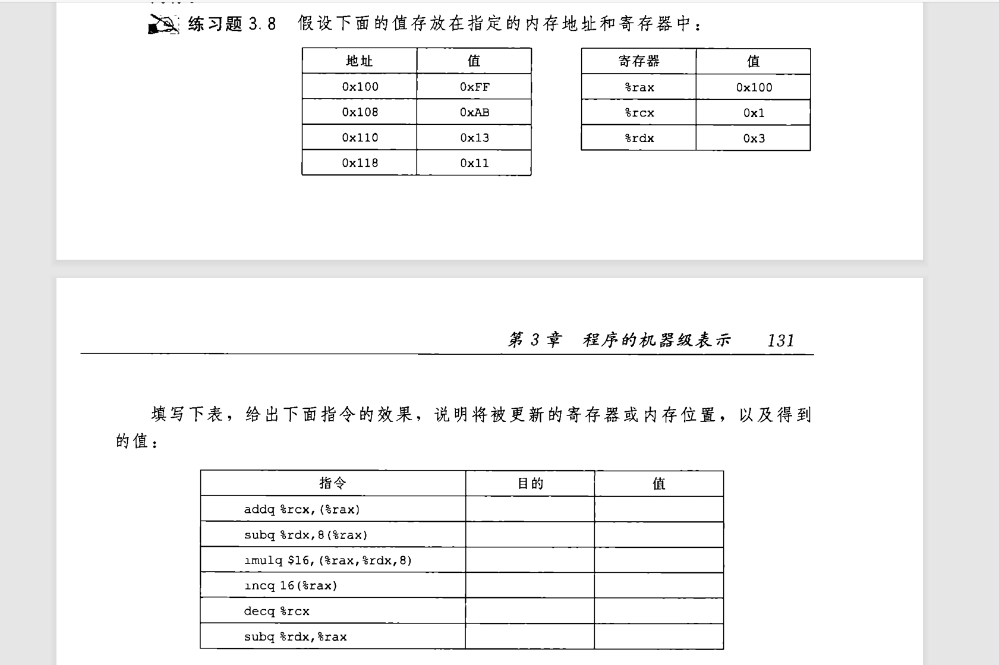
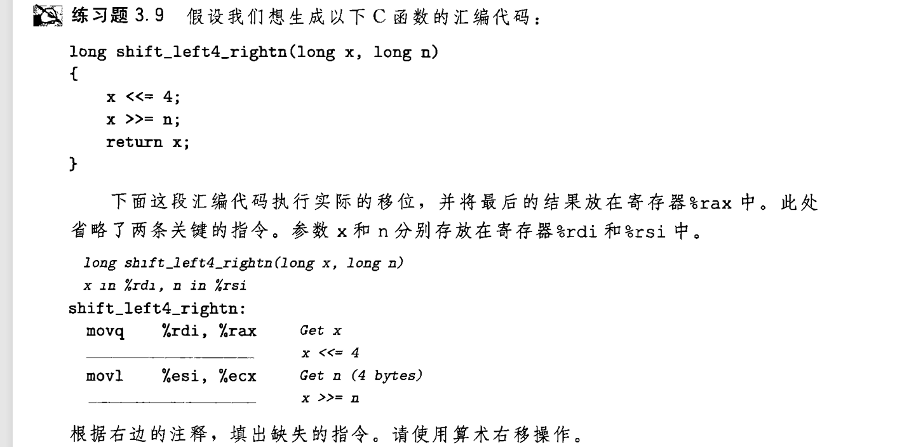

## 神奇的leaq
除了mov指令,还有很多算术逻辑指令
- lea
- inc dec neg[^1]
- add sub imul mul
- xor or and[^2]
- sal sar shr[^3]
[^1]:increment++ , decrement-- , negative 取相反数
[^2]:add src,dest 相当于 dest=dest+src 这六个符号同理 mul表示无符号数全乘  
[^3]:left right左移右移 , a意为*Arithmetic* 用于强调“有符号”语义 , 算术移位  

我们重点讨论leaq  
LEA = Load Effective Address , 而q表示对四字进行操作 
lea 指令可以简洁地描述一些算术运算,如:
```c
long add(long a,long b,long c){
    return a + 1 + b * 4;
}
```
编译为:
```
add:
    leaq 1(%rdi,%rsi,4), %rax ; %rdi和%rsi分别传递函数参数 , %rax储存返回值
	ret
```
**`1(%rdi,%rsi,4)`** 看似访问某个地址的内存,实则将两个寄存器的值按这种方式计算,传递给dest  
  
好了我们看题:  

  
和喝水一样 :smile:

## 算术指令练习



注意一下细节就能做对 :angry:

## 移位练习
```
sal num,src ; num是移位量 , src是待移位的数
```


知识点:
- 移位时移位量多大都可以只看num的最低位字节,num使用寄存器的值时,就使用一字节寄存器,如`%cl`
- sal的后缀由src决定


[下一章](3.10_11_C.md)